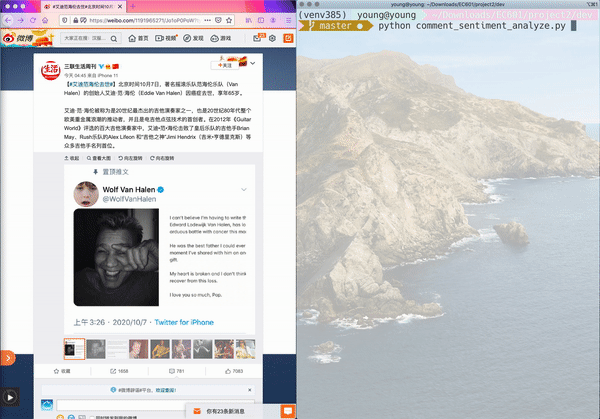

# Social Media Analyzer

Project 2 for EC601

*p.s. Because my application of Twitter Developer Account was rejected (for twice...), I made a comment analyzer for [Weibo](https://www.weibo.com), a Chinese social media platform similar to Twitter.*

### Description

- **name:** weibo comment sentiment analyzer
- **category:** command line tool, written in python
- **API used:** 
  - [Google Natural Language](https://cloud.google.com/natural-language/)
  - [weibo](lxyu.github.io/weibo/) (a concise third-party weibo python sdk which support python3)

### MVP

Input the `id` or `mid` of a piece of weibo, return the overall sentiment of comments (average of the first `count` comments), and also return the most negative, the most positive, and the strongest comments.

### User Story

For influencers or business accounts, they can use this tool to know their follower's attitude towards a weibo, to evaluate this weibo's popularity, or maybe they can make some adjustment in their later weibos.

For sociologists, they can use this tool to know the public opinion of a weibo or a topic, and analyze the social impact.

For public relations officer, they can use this tool to know users' opinion to some weibos, to evaluate their work, or take further actions if, for example, users are offended by that weibo.

### Usage

- follow instructions on Google Cloud tutorial, create Google Natural Language project, and download configuration file, name it as `Google_API_Key.json`, and store it in the `dev/config/` directory.
- follow instructions on Weibo Open Platform, apply for weibo developer permission, and create a micro-service, get API_KEY and API_SECRET, and store them in `dev/config/Weibo_API_Config.py`. 

- add configuration files to `dev/config`.
- install dependencies using `pip install -r dev/requirements`.

- run `python dev/comment_sentiment_analyze.py`, and follow its instructions.

### Example

	

Analyzed comments of a weibo about Eddie Van Halen's death.

### Code

see in directory "dev"

### Reference

[1] [Google Natural Language Client Libraries Documentation](https://cloud.google.com/natural-language/docs/reference/libraries)

[2] [Weibo Python SDK (third party)](http://weibo.lxyu.net)

[3] [other-way-to-collect-sina-data](https://bindog.github.io/blog/2015/04/20/other-way-to-collect-sina-data)

[4] [Weibo Official API Document](https://open.weibo.com/wiki/API%E6%96%87%E6%A1%A3_V2/en)